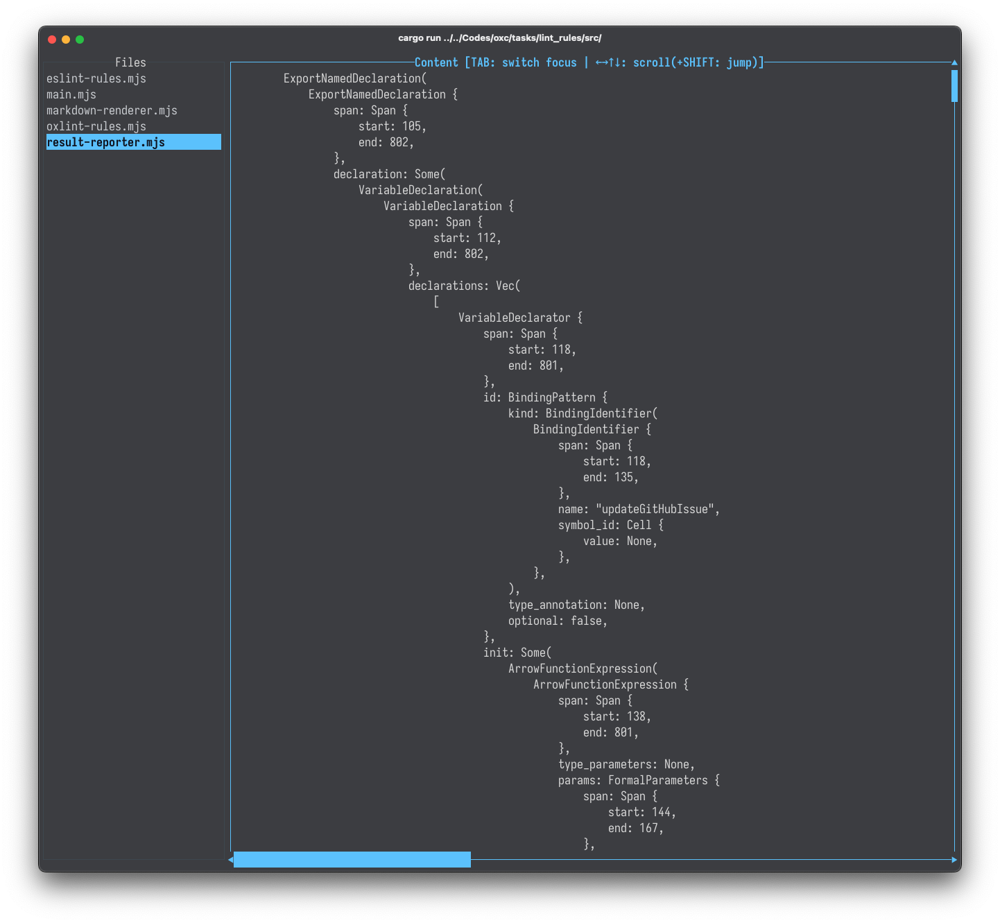

# oxc-parser-tui

Simple TUI viewer w/ oxc-parser and ratatui.

## Feature

- Pass root directory path to the CLI
- CLI read the file list in the directory
- TUI starts
- UI has two column
  - Select file list column
  - Then read and parse it into AST, display
- Navigate with keyboard

## Screenshot

